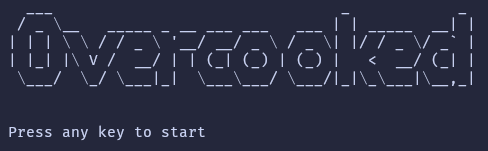

  

# Overcooked in C

## :bookmark_tabs: Overview

This project was developed as a college assignment" for the Programming I subject of my Computer Science graduation.
Written in c the game is based on Overcooked, a co-op cooking game.

  
  https://user-images.githubusercontent.com/68995946/235532010-ad4acc2d-6dfd-4673-99bf-eb71efc9e8d0.mp4
  

## :rocket: How to run the game

- Run `make` to generate the temporary files (`.o` files) and the binary (`overcooked`);
- Run `./overcooked [MAP]` to run the game, the `MAP` is the path to the map file, there are some maps in the folder `maps/` if you don't provide it the default map rendered is `maps/map.txt`;
- Run `make clean` to remove the temporary files and the binary;

## :joystick: How to Play

- After you run it a menu screen will show you, select the modes with `UP` and `DOWN` arrow keys and select it with the `SPACE` key;
- Press `q` any time to leave the game;
- You can move the character `&` with the arrow keys or W/A/S/D;
- The main goal of the game is to deliver in time the order's meal following the respective recipe;
- The `@` is where you deliver the meal and the `o` is the trash;
- You have 5 lives if you deliver a wrong meal you lose 2 lives and if you use the trash you lose one life. If you lose all of your lives it's game over;
- Deliver the maximum amount of orders to maximize your points.

## :handshake: Contribution

If you want to add any contribution just make a pull request, and I'll be happy to answer it.

## :memo: License

This project is licensed under the **MIT License** - see the [LICENSE](LICENSE) file for details.
